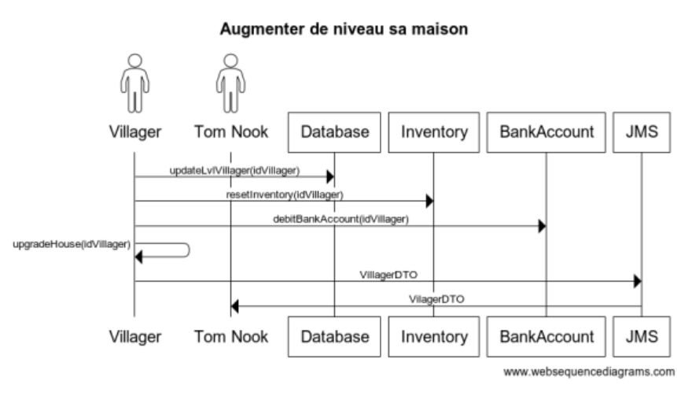

# Acteurs

- Tom Nook, le maire
- Les habitants
- Les commerçants

# Objectifs du système à modéliser

On propose de modéliser un système de gestion de village permettant à ses habitants de communiquer directement avec le maire (Tom Nook) et d’effectuer des achats pour améliorer leur habitat. 

Le projet inclus :

Service de gestion des villageois
Service de gestion des stocks
Service de gestion des pensions et des impots
Service de gestion des prêts

Fonctionnalités Kamikazes :
- Un villageois peut être banni du village : Lorsque qu'un villageois est incapable de payer ses impots il est banni par TN i.e. ne peut plus acheter d'objet ou recevoir sa pension (0.5 PT)
- Suite à leur achat, les villaegois recoivent une facture par mail sous forme de PDF crypté (1 PT)
- Les objets produits par le commerçant sont stocké en tant que NFT sur la BlockchainETH (3,5 PTS)

Exigences fonctionnelles :

VILLAGEOIS 
Un villageois possède un logement
Un villageois peut upgrade son logement
Un villageois possède un compte bancaire
Un villageois peut effectuer une demande prêt
Un villageois peut acheter des objets de décorations
Un villageois possède des critères de préférences sur les objets

COMMERÇANTS 
Un commerçant peut vendre des objets de décorations
Un commerçant peut produire des objets
Un commerçant peut publier la liste des objets produits

TOM NOOK
Tom Nook peut accorder/refuser un prêt
Tom Nook peut valider l’upgrade d’une maison
Tom Nook peut banir un villageois
Tom Nook peut consulter la liste des villageois
Tom Nook peut verser une pension/récolter les impots

LOGEMENT
Un logement possède un nombre maximum d’objet
Un logement possède un prix

Règles métier :

Un villageois ne peut avoir qu’un seul logement
Un logement ne peut pas être mis à niveau s’il ne contient pas le maximum d’objet
Un villageois ne peut plus acheter d’objets si son logement atteint le maximum d’objet autorisé 

